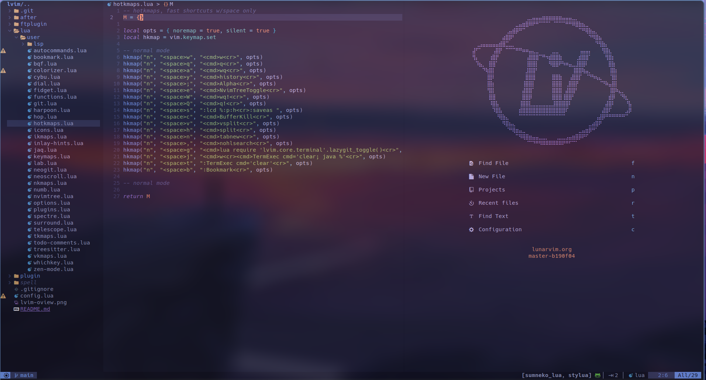

# My lvim config

</br>

### Overview


</br>

Replace `~/.config/lvim` and clone this repo

  ```
  git clone https://github.com/edenac/lvim.git ~/.config/nvim
  ```

## Get healthy

Open `lvim` and enter the following:

```
:checkhealth
```

You'll probably notice you don't have support for copy/paste also that python and node haven't been setup

So let's fix that

First we'll fix copy/paste

- On mac `pbcopy` should be builtin

- On Ubuntu

  ```sh
  sudo apt install xsel
  ```

- On Arch Linux

  ```sh
  sudo pacman -S xsel
  ```

Next we need to install python support (node is optional)

- Neovim python support

  ```sh
  pip install pynvim
  ```

- Neovim node support

  ```sh
  npm i -g neovim
  ```

## Fonts

- [A nerd font](https://github.com/ryanoasis/nerd-fonts)

- [codicon](https://github.com/microsoft/vscode-codicons/raw/main/dist/codicon.ttf)
- [An emoji font](https://github.com/googlefonts/noto-emoji/blob/main/fonts/NotoColorEmoji.ttf)

After moving fonts to `~/.local/share/fonts/`

Run: `$ fc-cache -f -v`

**NOTE:** (If you are seeing boxes without icons, try changing this line from `false` to `true`: [link](https://github.com/ChristianChiarulli/nvim/blob/ac41efa237caf3a498077df19a3f31ca4b35caf3/lua/user/icons.lua#L5))
